#### 
Вайцеховський Олександр ІПЗ 3-02
  
### 
Практично-лабораторне заняття №8
  
#### Тема:  
Неперервна інтеграція   
#### Мета: 
Ознайомитися з принципами і практиками 
неперервної інтеграції, сформувати навички 
автоматизації CI/CD процесів в GitHub Actions 
  
#### Посилання:
Репозиторій 1.1 [Github-Actions](https://github.com/OldAchoK/skills-hello-github-actions)  
Репозиторій 1.2 [Publish-Packages](https://github.com/OldAchoK/skills-publish-packages)  
Репозиторій 1.3 [Фронтенд](https://github.com/OldAchoK/vaitsekhovskyi-oleksandr-kpz-front-ci-cd)  
  
#### Хід роботи:
1. Проходження офіційних туторіалів від GitHub:  
	1.1 [Hello Github Actions](https://github.com/skills/hello-github-actions?tab=readme-ov-file):  
		1.1.1 Клонування репозиторію до власного акаунту, після чого перегляд вкладки  
  
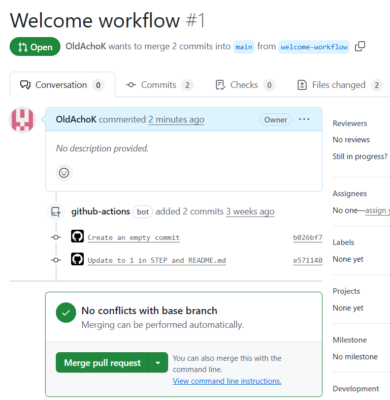  
  
		1.1.2 Додавання першого воркфлоу та комміт  
  
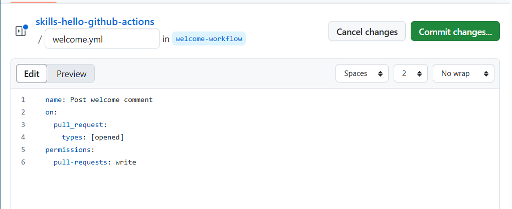  
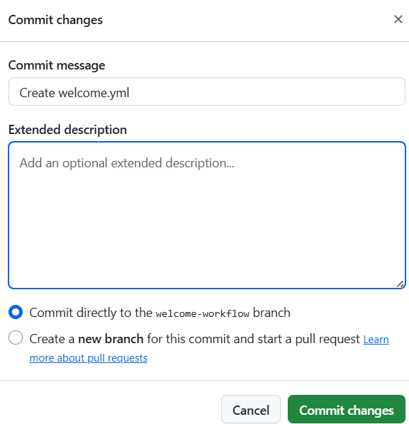  
  
		"Фіксинг багів"  
  
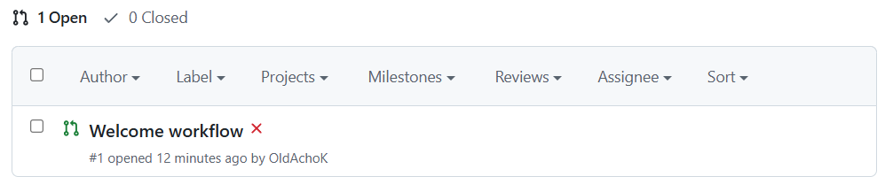  
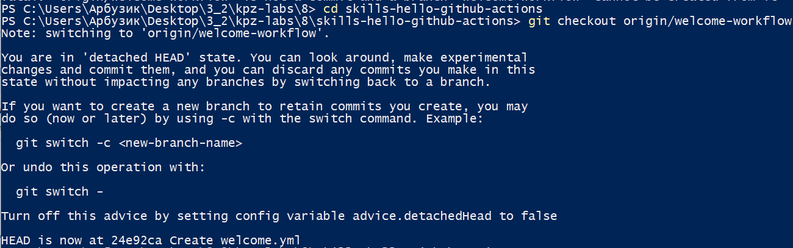  
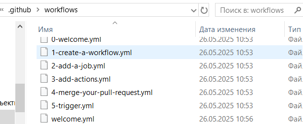  
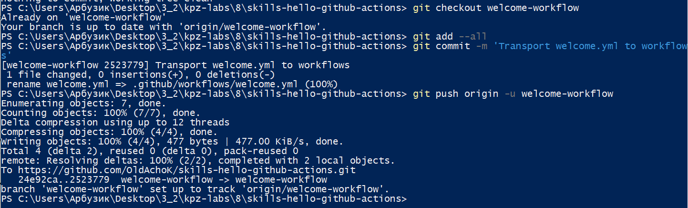  
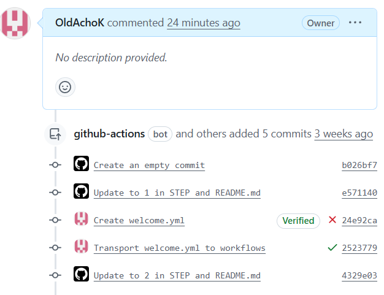  
  
		Удачний результат  
  
		1.1.3 Додавання "джоби"  
  
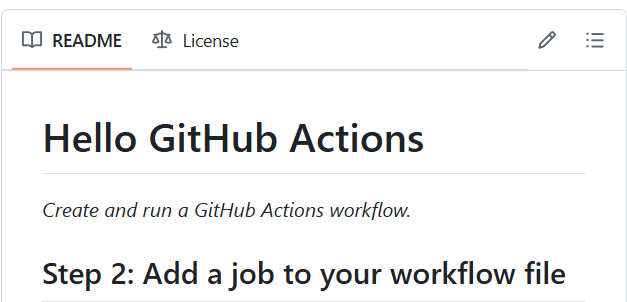  
  
		Додавання пустої вкладки 'jobs:'  
  
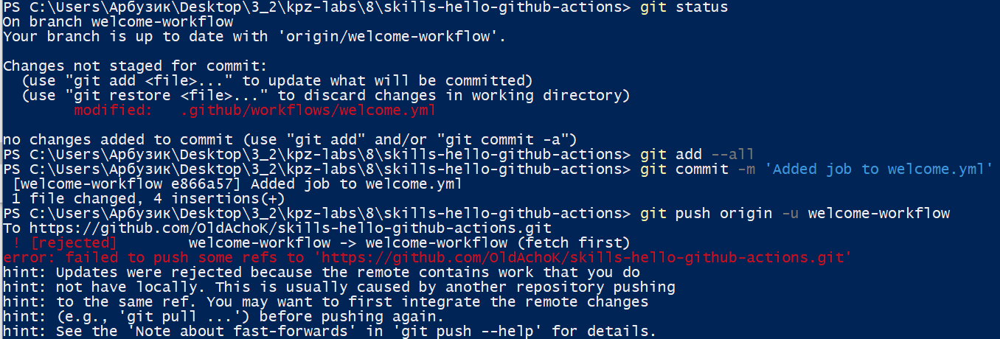  
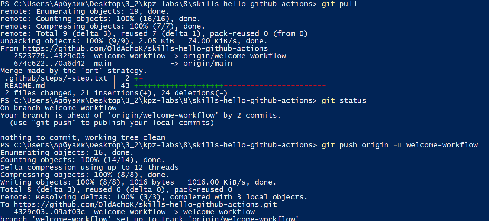  
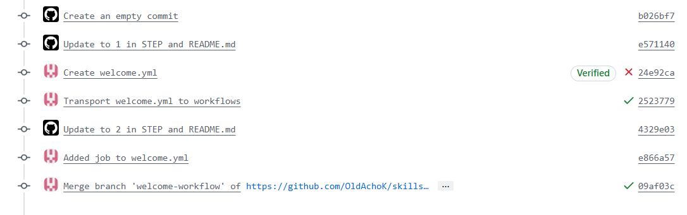  
  
		Позитивний результат  
  
		1.1.4 Додавання степів у воркфлоу  
  
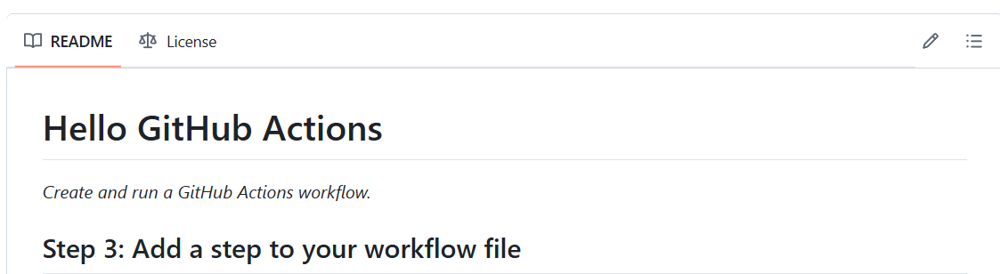  
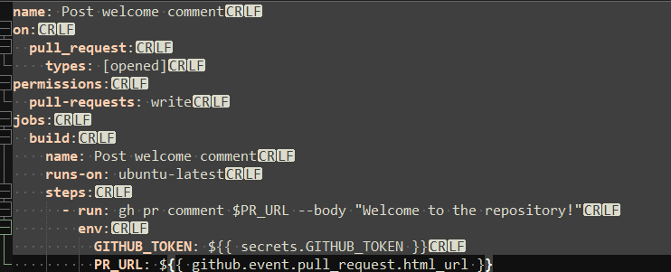  
  
		Коміт та пуш  
  
  
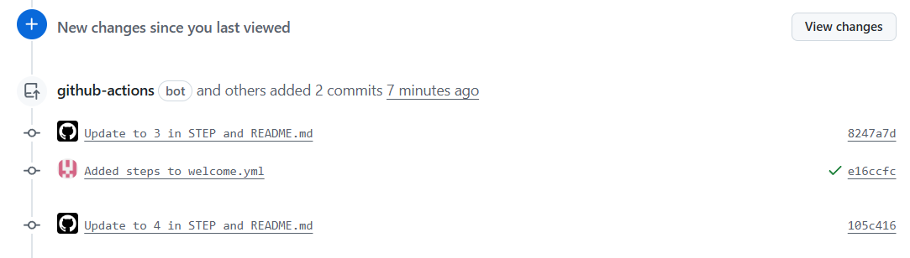  
  
		Позитивний результат  
  
		1.1.5 Мердж воркфлоу  
  
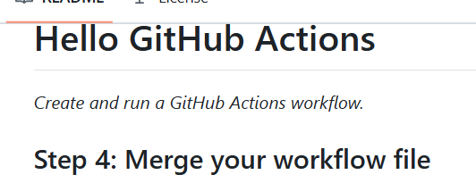  
  
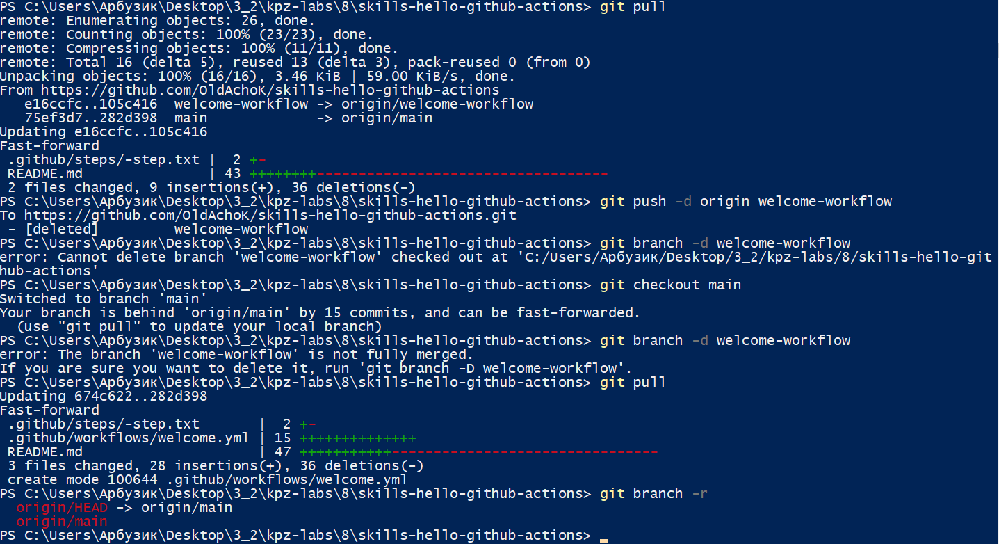  
  
		Тепер у репозиторії лише одна гілка  
  
		1.1.6 Тригер воркфлоу  
  
		  
  
		Створимо нову гілку  
  
		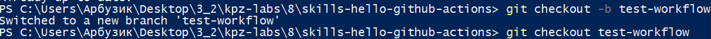  
  
		Змінемо файл рідмі  
  
  
  
		Локальний коміт та пуш до віддаленого репозиторію:  
  
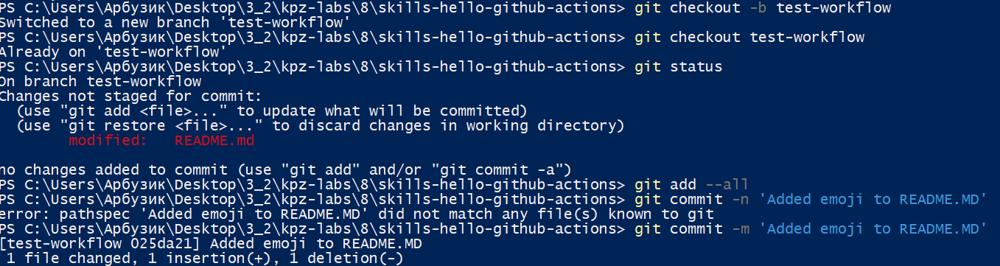  
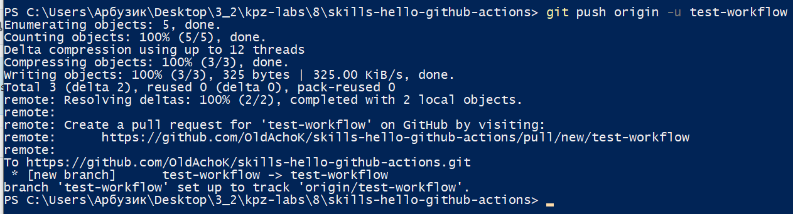  
  
		Перевірка конфліктів на репозиторію  
  
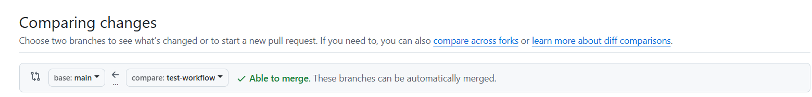  
  
		Результат:  
  
  
  
		1.1.7 Видалення зайвого та фініш курсу:  
  
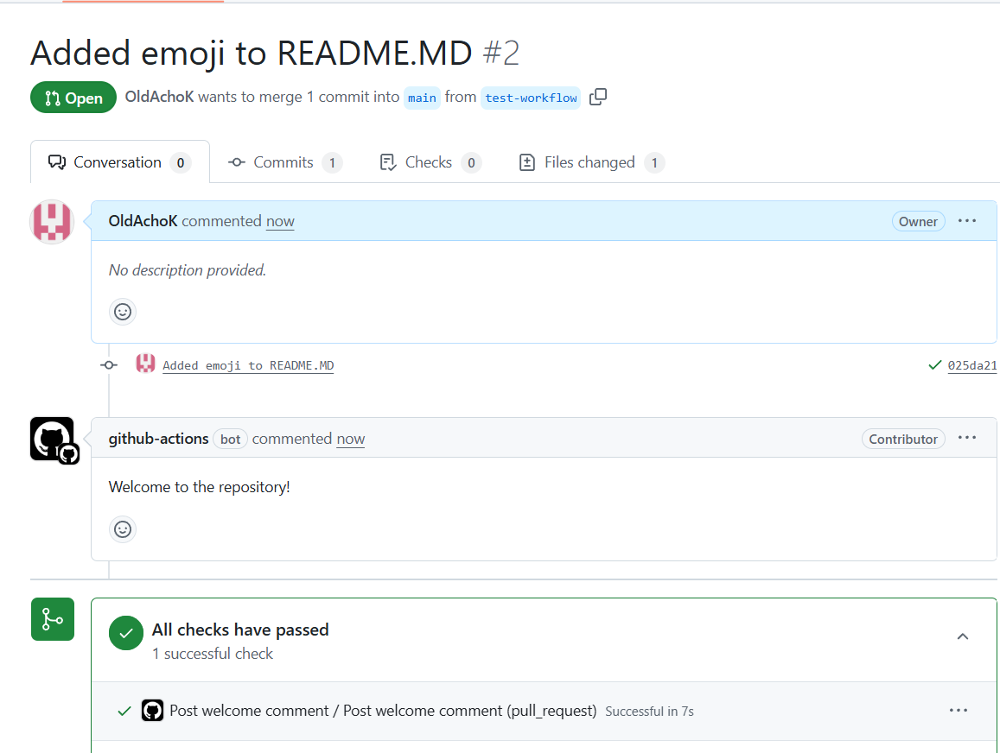  
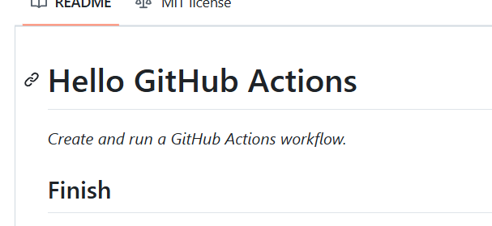  
  
		Результат  
		#### Невеличкий підсумок:  
		Протягом маленького курсу по Гітхаб Екшинам було засвоєно загальну структуру .yml файлів та роботу із воркфлоу. Було зазначено корисність такої технологоії для ефективної інтеграції та тестуванню нового коду.
  
	1.2 Проходження курсу [Publish Packages](https://github.com/skills/publish-packages)  
		1.2.1 Клонування репозиторію та створення ось такого воркфлоу  
  
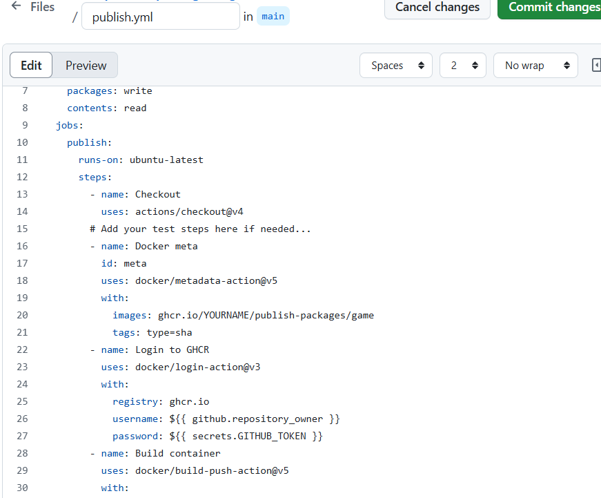  
  
		Позитивний результат:  
  
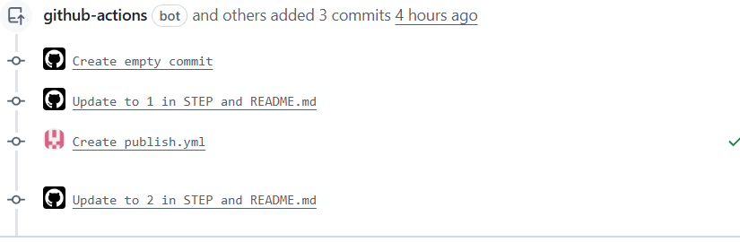  
  
		Створення докерфайлу  
  
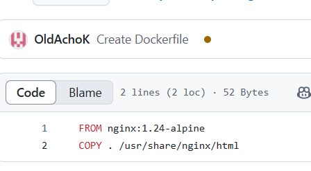
  
		1.2.2 Публікація ДокерІмеджу  
  
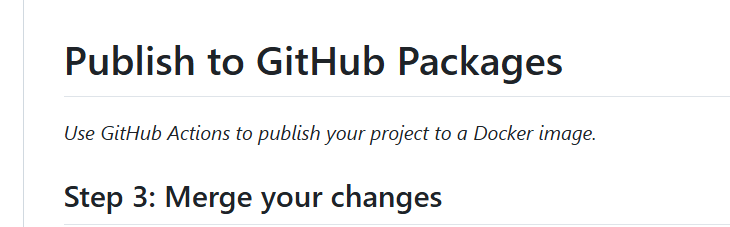
  
		Перевіряємо, щоб у акшинах не було конфліктів  
  
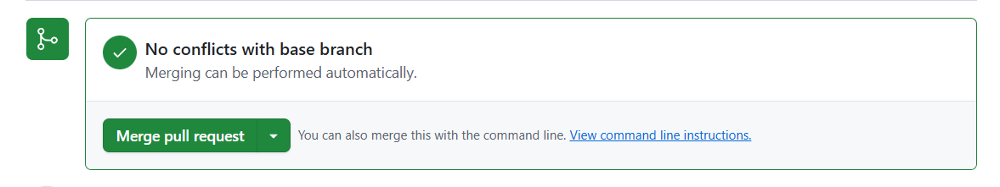
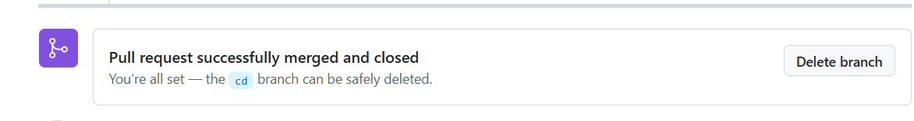
  
		1.2.3 Після того як імедж був собраний протестуємо його на локальній системі підтягнувши його через сервіс пєкєджис від гітхаб  
  
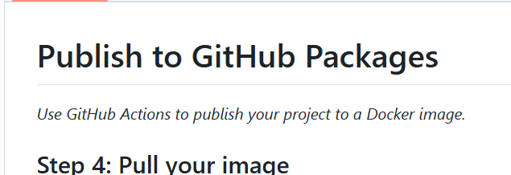
  
		Логін до сервісу  
  
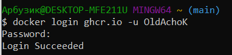
  
		Підтягування докер образу з сервібу   
  
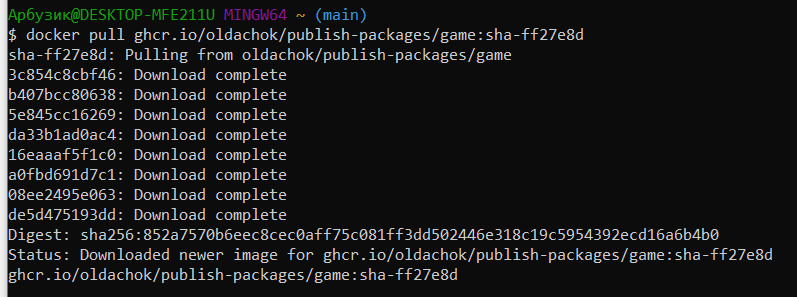
  
		Перевірка що образ підтянувся  
  
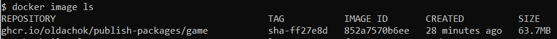
  
		Запуск докер образу  
  

  
		Перевірка його запуску через утиліту Docker Desktop  
  

  
		Запуск у браузері  
  
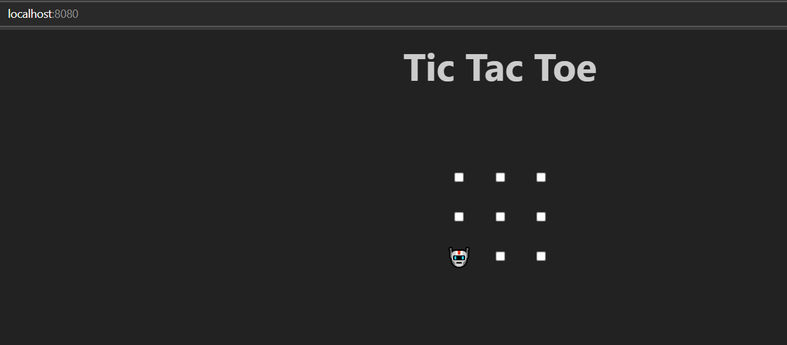
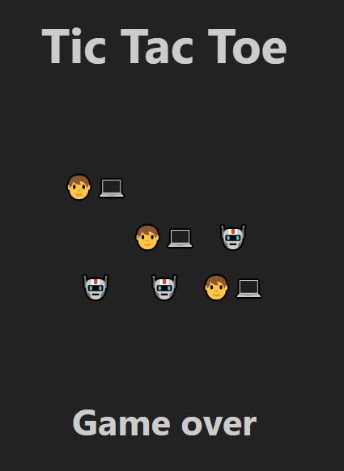  
  
		#### Проміжний висновок:  
		Після проходження курсу було засвоєно матеріал про конфігураційні файли докер образів иа їх розміщення у сервісі Гітхаб Пєкєджис.  
  
	1.3 Створення воркфлоу та публікація докер образу для власного фронтенд репозиторію  
  
		1.3.1 Виконання джоби по публікації:  
  
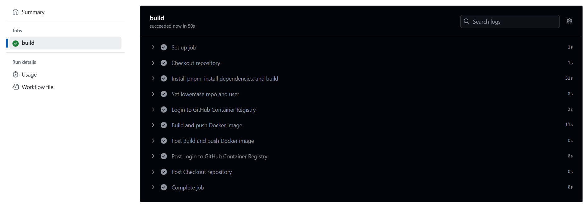

		1.3.2 Перевірка функціоналу запитаного у ТЗ:  
  
  
  
		1.3.3 Готовий докер образ прикріплений до репозиторію:  
  
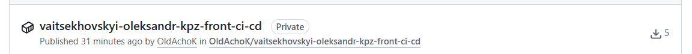  
  
#### Висновок:
Протягом цієї роботи були засвоєні теоретичні матеріали з обширної теми Continuous Integration\Delivery\Deployment та практично закріпленні із створенням власного воркфлоу для сборку докер образу проекту.