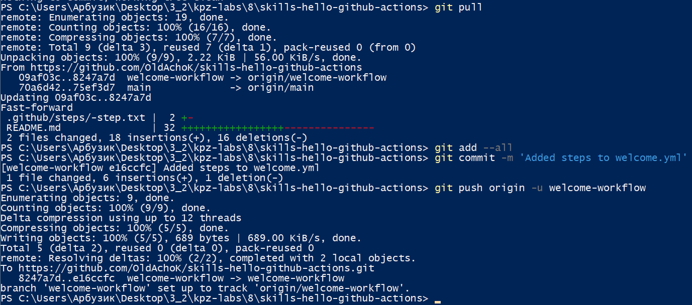
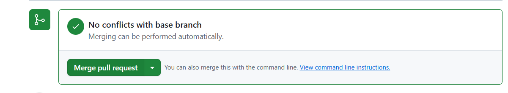
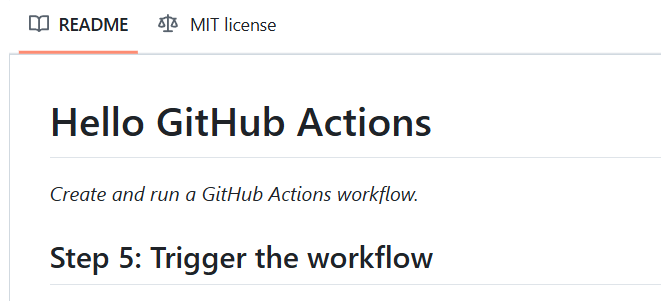
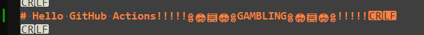
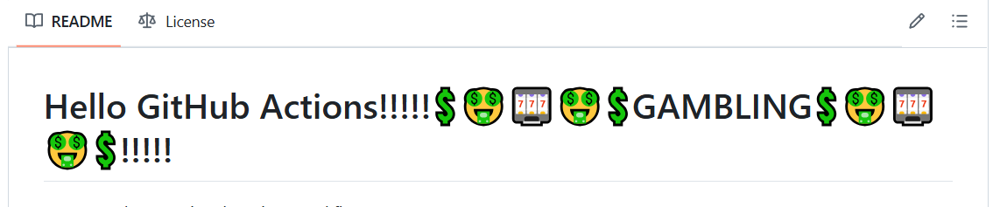

#### 
Вайцеховський Олександр ІПЗ 3-02
  
### 
Практично-лабораторне заняття №8
  
#### Тема:  
Неперервна інтеграція   
#### Мета: 
Ознайомитися з принципами і практиками 
неперервної інтеграції, сформувати навички 
автоматизації CI/CD процесів в GitHub Actions 

#### Хід роботи:
1. Проходження офіційних туторіалів від GitHub:
1.1 :
1.1.1 Клонування репозиторію до власного акаунту, після чого перегляд вкладки 

1.1.2 Додавання першого воркфлоу та комміт

"Фіксинг багів"

Удачний результат
1.1.3 Додавання "джоби"

Додавання пустої вкладки 'jobs:'

Позитивний результат
1.1.4 Додавання степів у воркфлоу

Коміт та пуш

Позитивний результат
1.1.5 Мердж воркфлоу

Тепер у репозиторії лише одна гілка
1.1.6 Тригер воркфлоу

Створимо нову гілку

Змінемо файл рідмі

Локальний коміт та пуш до віддаленого репозиторію:

Перевірка конфліктів на репозиторію

Результат:

1.1.7 Видалення зайвого та фініш курсу:

Результат
#### Невеличкий підсумок:
Протягом маленького курсу по Гітхаб Екшинам було засвоєно загальну структуру .yml файлів та роботу із воркфлоу. Було зазначено корисність такої технологоії для ефективної інтеграції та тестуванню нового коду.
